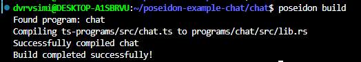

# Building a Chat Program with Poseidon

## Overview
In this tutorial, we'll build a chat program where users can post, edit, and delete messages. Each message will have a title, content, author, and timestamp.

## Prerequisites
Make sure you have completed the environment setup from the Poseidon main tutorial. You'll need:
- Rust and Cargo
- Solana CLI
- Yarn
- Anchor CLI
- Poseidon binary

## Program Structure
Our chat program will have the following instructions:
1. `initialize` - Create a new chat
2. `postMessage` - Post a new message
3. `editMessage` - Edit an existing message (only by the author)
4. `deleteMessage` - Delete a message (only by the author)

## Implementation Steps

### 1. Create Project Scaffold
```bash
poseidon init chat
cd chat
```

### 2. Define Program Structure
We would create a structure that we will improve as we proceed. Navigate to file `ts-programs/src/chat.ts` and paste the code below:

```typescript
import { 
  Account, 
  Pubkey, 
  type Result, 
  i64, 
  u8, 
  Signer, 
  string 
} from "@solanaturbine/poseidon";

export default class ChatProgram {
  static PROGRAM_ID = new Pubkey("11111111111111111111111111111111"); // system program id


  // these will be transpiled as program instructions
  initialize(): Result {} 
  postMessage(): Result {}
  editMessage(): Result {}
  deleteMessage(): Result {}
}

// Message account structure
export interface Message extends Account {
  author: Pubkey;     // Message author's public key
  title: string;      // Message title
  content: string;    // Message content
  timestamp: i64;     // Posted timestamp
  bump: u8;          // PDA bump
}

// Board state account structure
export interface BoardState extends Account {
  authority: Pubkey;  // Board admin
  messageCount: i64;  // Total number of messages
  bump: u8;          // PDA bump
}
```

### 3. Implement Instructions
In the individual instructions, implement the instruction logic
#### Initialize Board
```typescript
initialize(
  authority: Signer,
  boardState: BoardState // interface defined in structure above
): Result {
  // Initialize board state PDA
  boardState.derive(["board"])
           .init(authority);
  
  // Set initial values
  boardState.authority = authority.key;
  boardState.messageCount = new i64(0);
  boardState.bump = boardState.getBump();
}
```

#### Post Message
```typescript
postMessage(
  author: Signer,
  message: Message,
  boardState: BoardState, 
  title: Str<64>, // string type in poseidon
  content: Str<1024>
): Result {
  // Derive board state PDA
  boardState.derive(["board"]);
  
  // Create unique message PDA using message count as seed
  message.derive([
    "message",
    boardState.messageCount.toBytes(),
    author.key
  ]).init(author);
  
  // Set message data
  message.author = author.key;
  message.title = title;
  message.content = content;
  message.timestamp = new i64(Date.now());
  message.bump = message.getBump();
  
  // Increment message count
  boardState.messageCount = boardState.messageCount.add(1);
}
```

#### Edit Message
```typescript
editMessage(
  author: Signer,
  message: Message,
  boardState: BoardState,
  newTitle: Str<64>,
  newContent: Str<1024>
): Result {
  // Verify author
  if (message.author != author.key) { // using trad != for now
    throw new Error("Only the author can edit this message");
  }
  
  // Update message content
  message.title = newTitle;
  message.content = newContent;
}
```

#### Delete Message
```typescript
deleteMessage(
  author: Signer,
  message: Message,
  boardState: BoardState
): Result {
    boardState.derive(["board"]);
        
    message.derive([
        "message",
        message.messageIndex.toBytes(),
        author.key
    ]);

  // Verify author
    if (message.author != author.key) {
        throw new Error("Only the author can delete this message");
    }
  
  // Close the message account and return rent to author
    message.close(author);
}
```

### 4. Writing a test
Go to `tests/chat.ts`:

```typescript
import * as anchor from "@coral-xyz/anchor";
import { Program } from "@coral-xyz/anchor";
import { Chat } from "../target/types/chat";
import { assert } from "chai";

describe("chat program", () => {
  const provider = anchor.AnchorProvider.env();
  anchor.setProvider(provider);
  const program = anchor.workspace.Chat as Program<ChatProgram>;

  it("Initialize board", async () => {
    // Test initialization
  });

  it("Post message", async () => {
    // Test posting message
  });

  it("Edit message", async () => {
    // Test editing message
  });

  it("Delete message", async () => {
    // Test deleting message
  });
});
```

### 5. Build and Deploy
```bash
# Build the program
poseidon build

# Test locally
poseidon test

# Deploy to devnet (optional)
anchor deploy --provider.cluster devnet
```

After a successful build, you should see an output similar to the one below


## Key Concepts Covered

1. Program Derived Addresses (PDAs)
2. Account Management
3. State Management
4. Access Control

## References
- [Poseidon Documentation](https://github.com/Turbin3/poseidon)
- [Vote tutorial with Poseidon](https://github.com/dvrvsimi/poseidon/blob/master/docs/src/tutorial.md)

- [Solana Account Model](https://solana.com/docs/core/accounts)
- [Program Derived Addresses](https://solana.com/docs/core/pda)


